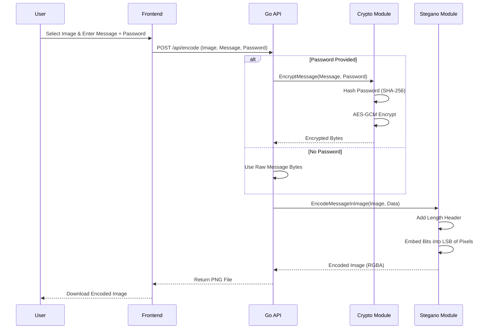
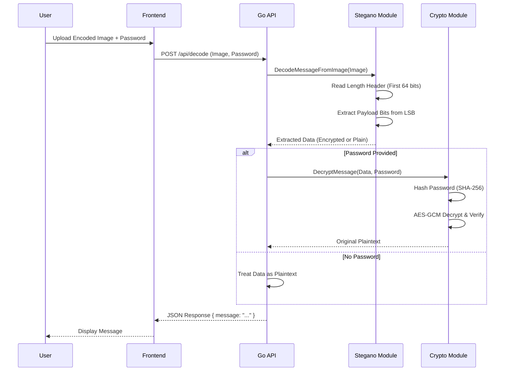

<div align="center">

# Steganography Tool Project Report

**Submitted by:**
Ork Senghout
GROUP 2

**Institution:**
Cambodia Academy of Digital Technology

**Course:**
Cryptography

**Instructor:**
Teacher Meas Sothearath

**Date:**
November 28, 2025

</div>

<div style="page-break-after: always;"></div>

# I. Introduction / Background

## Project Goal
The primary goal of this project is to develop a secure and user-friendly **Steganography Tool** that allows users to hide secret text messages within digital images. Unlike traditional encryption, which scrambles data but leaves the communication visible, this tool aims to provide **covert communication** by concealing the very existence of the message.

## Problem Statement
In an era of pervasive digital surveillance, protecting the privacy of communication is increasingly challenging.
1.  **Visibility of Encryption**: Standard encrypted messages (like PGP or encrypted emails) clearly signal that sensitive information is being transmitted, potentially attracting unwanted attention from adversaries.
2.  **Complexity**: Many steganographic tools are command-line based or require complex installation, making them inaccessible to average users.
3.  **Lack of Security**: Basic steganography tools often hide plain text. If the hidden message is detected, it can be easily read.

## Proposed Solution
This project implements a web-based application that combines **Cryptography** and **Steganography** to address these issues:
-   **Obscurity**: Uses **Least Significant Bit (LSB)** steganography to embed data into the noise of an image, making it invisible to the human eye.
-   **Confidentiality**: Incorporates **AES-256-GCM** encryption to ensure that even if the hidden data is extracted, it cannot be read without the correct password.
-   **Accessibility**: Provides a modern, responsive web interface that works on any device with a browser.

## Motivation
The motivation behind this project is to explore the intersection of security and privacy. It serves as a practical application of cryptographic primitives (AES, SHA-256) and image processing algorithms, demonstrating how different security layers can be layered to provide robust protection for sensitive data.

## Related Cryptographic Concepts

### 1. Steganography
Derived from Greek words *steganos* (covered) and *graphein* (writing). It is the practice of concealing a file, message, image, or video within another file, message, image, or video.
-   **Carrier**: The signal, stream, or data file that hides the payload (in this case, a PNG image).
-   **Payload**: The information to be hidden (the secret message).

### 2. Least Significant Bit (LSB)
A common steganographic technique where the last bit of each pixel's byte is replaced with a bit of the secret message. Since the change is minimal (changing a color value by 1 out of 255), the alteration is imperceptible to the human visual system.

### 3. Advanced Encryption Standard (AES)
A symmetric block cipher chosen by the U.S. government to protect classified information. This project uses **AES-256**, which uses 256-bit keys.

### 4. Galois/Counter Mode (GCM)
A mode of operation for symmetric-key cryptographic block ciphers. It provides both **data authenticity (integrity)** and **confidentiality**. It ensures that the message has not been tampered with during transmission.

### 5. Hashing (SHA-256)
A cryptographic hash function that outputs a value that is 256 bits long. In this project, it is used for **Key Derivation**, converting a user-provided password of any length into a fixed-size 32-byte key required for AES-256.

<div style="page-break-after: always;"></div>

# II. System Design / Architecture

## System Overview
The Steganography Tool follows a classic **Client-Server Architecture**. It is designed to be stateless, ensuring scalability and privacy (no user data is stored on the server).

### High-Level Architecture

```mermaid
graph LR
    User[User] -- Browser --> Frontend[Frontend (HTML/JS)]
    Frontend -- HTTP POST --> Backend[Backend API (Go)]
    Backend -- Process --> Logic[Core Logic (Crypto/Stegano)]
    Logic -- Return --> Backend
    Backend -- Response --> Frontend
```

## Data Flow Diagrams

### 1. Encoding Process (Hiding a Message)

This flow describes how a message travels from the user to the final encoded image.



### 2. Decoding Process (Extracting a Message)

This flow describes how a hidden message is retrieved from an image.



## Component Structure

### Frontend Layer
-   **HTML5/CSS3**: Provides the structure and styling (Dark Mode UI).
-   **JavaScript (Vanilla)**: Handles user interactions, file previews, and asynchronous API calls (`fetch`).

### Backend Layer (Go)
-   **Router (`main.go`)**: Routes HTTP requests to appropriate handlers.
-   **Handlers (`handlers/`)**:
    -   `HandleEncode`: Parses multipart forms, orchestrates encryption and encoding.
    -   `HandleDecode`: Parses multipart forms, orchestrates decoding and decryption.
-   **Utilities (`utils/`)**:
    -   `crypto.go`: Encapsulates AES-256-GCM and SHA-256 logic.
    -   `steganography.go`: Contains the low-level pixel manipulation logic for LSB.

## Security Architecture
1.  **Transport Security**: The application is designed to run behind Nginx with SSL/TLS (HTTPS), ensuring data is encrypted in transit between client and server.
2.  **Data Security**:
    -   **At Rest**: No data is stored on the server. Images are processed in memory and returned immediately.
    -   **In Image**: Data inside the image is encrypted with AES-256 (if password is used), rendering it useless to steganalysis tools that might detect the hidden data but cannot read it.

<div style="page-break-after: always;"></div>

# III. Implementation Details

This section details the core algorithms and code structure used in the project.

## Technology Stack
-   **Language**: Go (Golang) 1.21+
-   **Standard Libraries**: `image`, `image/png`, `crypto/*`, `net/http`
-   **Frontend**: HTML5, CSS3, JavaScript (ES6+)

## 1. Cryptographic Implementation (`utils/crypto.go`)

The project uses the Go standard library's `crypto` packages.

### Key Derivation
Since AES requires a fixed-size key (32 bytes for AES-256), user passwords are hashed.
```go
// Hash password with SHA-256 to get 32-byte key
hash := sha256.Sum256([]byte(password))
key := hash[:]
```

### Encryption (AES-GCM)
We use Galois/Counter Mode (GCM) because it provides authenticated encryption.
1.  **Nonce Generation**: A unique 12-byte nonce is generated for every encryption using `crypto/rand`.
2.  **Sealing**: The `gcm.Seal` function encrypts the data and appends an authentication tag.
3.  **Packing**: The final payload structure is `[Nonce (12 bytes)] + [Ciphertext] + [Auth Tag]`.

### Decryption
1.  **Unpacking**: The nonce is extracted from the first 12 bytes of the data.
2.  **Opening**: `gcm.Open` decrypts the ciphertext and verifies the authentication tag. If the password is wrong or data corrupted, it returns an error.

## 2. Steganography Implementation (`utils/steganography.go`)

The core logic relies on manipulating the **Least Significant Bit (LSB)** of image pixels.

### Data Preparation
Before embedding, the message is prefixed with a length header to ensure the decoder knows exactly how much data to read.
-   **Header**: 8 bytes (string representation of length, e.g., "00000123").
-   **Payload**: The actual message bytes (or encrypted bytes).

### Encoding Algorithm (`EncodeMessageInImage`)
1.  **Image Copy**: A mutable copy (`image.RGBA`) of the source image is created.
2.  **Iteration**: The code iterates through every pixel (x, y).
3.  **Bit Insertion**:
    -   The algorithm processes the Red, Green, and Blue channels sequentially.
    -   For each channel, the LSB is cleared (`val & 0xFE`) and replaced with a bit from the data (`val | bit`).
    -   This allows storing 3 bits per pixel.
4.  **Termination**: The loop stops once all data bits are embedded.

```go
// Example bit insertion logic
bit := (data[byteIndex] >> (7 - bitOffset)) & 1
channel = (channel & 0xFE) | bit
```

### Decoding Algorithm (`DecodeMessageFromImage`)
1.  **Header Extraction**: The first 64 bits (8 bytes * 8 bits) are read from the image pixels to reconstruct the length header.
2.  **Length Parsing**: The header string is parsed to an integer (e.g., "00000010" -> 10 bytes).
3.  **Payload Extraction**: The loop continues reading LSBs until the specified number of bytes is retrieved.

## 3. API Handlers (`handlers/api.go`)

The handlers act as controllers, bridging the HTTP layer with the logic layer.

-   **Multipart Parsing**: Handles file uploads up to 10MB.
-   **Error Handling**: Returns JSON error responses (`{"error": "message"}`) for invalid inputs or processing failures.
-   **CORS**: Middleware is implemented to allow cross-origin requests during development or specific domains in production.

## 4. Frontend Implementation

-   **File API**: Uses `FileReader` to show image previews before upload.
-   **Fetch API**: Sends asynchronous `POST` requests to the backend.
-   **Blob Handling**: When receiving the encoded image, the frontend converts the binary response into a Blob URL for downloading.

<div style="page-break-after: always;"></div>

# IV. Usage Guide

This guide provides step-by-step instructions on how to build, run, and use the Steganography Tool.

## Prerequisites
-   **Go**: Version 1.21 or higher installed.
-   **Web Browser**: Chrome, Firefox, Edge, or Safari.
-   **Operating System**: Windows, Linux, or macOS.

## Building and Running

### 1. Local Development (Windows/Linux/Mac)

1.  **Navigate to the backend directory**:
    ```bash
    cd backend
    ```

2.  **Run the server**:
    ```bash
    go run main.go
    ```
    *Output:*
    ```
    🚀 Steganography server running on http://localhost:8080
    📁 Frontend available at: http://localhost:8080
    ```

3.  **Access the Application**:
    Open your web browser and go to `http://localhost:8080`.

### 2. Production Deployment (Ubuntu Server)

An automated script is provided for deployment.

1.  **Upload the code** to your server.
2.  **Run the deployment script**:
    ```bash
    chmod +x deploy.sh
    sudo ./deploy.sh
    ```
    This will install Nginx, Certbot, build the app, and set up a systemd service.

## User Guide

### Feature 1: Encoding (Hiding a Message)

1.  **Select Tab**: Click on the **"Encode"** tab.
2.  **Upload Image**: Click the file input area and select a **PNG** image.
    *   *Note: PNG is recommended because it is lossless. JPEG compression can destroy the hidden LSB data.*
3.  **Enter Message**: Type the secret message you want to hide in the text area.
4.  **Set Password (Optional)**:
    -   Enter a password to encrypt the message.
    -   If left blank, the message will be hidden but not encrypted.
5.  **Process**: Click the **"Encode Message"** button.
6.  **Download**: Once finished, a "Download Encoded Image" button will appear. Click it to save the result.

### Feature 2: Decoding (Reading a Message)

1.  **Select Tab**: Click on the **"Decode"** tab.
2.  **Upload Image**: Select the image that contains the hidden message.
3.  **Enter Password**:
    -   If the message was encrypted, you **must** enter the same password used during encoding.
    -   If no password was used, leave this field blank.
4.  **Process**: Click the **"Decode Message"** button.
5.  **View Result**: The hidden message will appear on the screen. You can use the "Copy" button to copy it to your clipboard.

## Example Scenario

1.  **Alice** wants to send a secret bank account number to **Bob**.
2.  Alice opens the tool, uploads a picture of a cat (`cat.png`).
3.  Alice types the account number and sets the password to `Secret123!`.
4.  Alice downloads the result (`encoded.png`) and emails it to Bob.
5.  **Bob** receives the email. To anyone else, it looks like just a cat picture.
6.  Bob opens the tool, uploads `encoded.png`, enters `Secret123!`, and retrieves the account number.

<div style="page-break-after: always;"></div>

# V. Conclusion and Future Work

## Conclusion
This project successfully demonstrates the implementation of a secure steganography tool by combining **Least Significant Bit (LSB)** encoding with **AES-256-GCM** encryption.

**Key Achievements:**
1.  **Functional Integration**: Successfully integrated a Go backend with a modern HTML/JS frontend.
2.  **Security**: Implemented robust encryption to ensure that hidden messages are confidential and tamper-proof.
3.  **Usability**: Created an intuitive interface that abstracts the complex underlying mathematics and bit manipulation from the user.
4.  **Performance**: The use of Go ensures fast image processing, even for moderately large images.

The tool effectively solves the problem of covert communication by allowing users to hide data in plain sight, leveraging the ubiquity of digital images.

## Future Work
While the current system is functional and secure, several enhancements could be made in future iterations:

### 1. Support for More Image Formats
Currently, the tool relies on PNG (lossless). Supporting **JPEG** would require more complex algorithms (like DCT coefficient modification) to survive compression artifacts.

### 2. Advanced Key Derivation
Currently, SHA-256 is used to hash the password. To better resist brute-force attacks, a memory-hard function like **Argon2id** or **scrypt** should be implemented.

### 3. Adaptive Steganography
Instead of sequential LSB replacement (which can be statistically detected), the tool could implement **adaptive algorithms** that hide data in "noisy" areas of the image (edges, textures) where it is harder to detect.

### 4. Mobile Application
Developing a native mobile app (React Native or Flutter) would make the tool more accessible for secure communication on the go.

### 5. Public Key Cryptography
Implementing **RSA** or **Elliptic Curve Cryptography (ECC)** would allow users to encrypt messages for specific recipients without sharing a password beforehand.

<div style="page-break-after: always;"></div>

# VI. References

## Cryptography Standards
1.  **NIST (National Institute of Standards and Technology)**. (2001). *Advanced Encryption Standard (AES)*. FIPS PUB 197.
2.  **NIST**. (2007). *Recommendation for Block Cipher Modes of Operation: Galois/Counter Mode (GCM)*. SP 800-38D.
3.  **NIST**. (2015). *Secure Hash Standard (SHS)*. FIPS PUB 180-4.

## Steganography
4.  **Johnson, N. F., & Jajodia, S.** (1998). *Exploring Steganography: Seeing the Unseen*. IEEE Computer, 31(2), 26-34.
5.  **Cheddad, A., et al.** (2010). *Digital Image Steganography: Survey and Analysis of Current Methods*. Signal Processing, 90(3), 727-752.

## Programming & Libraries
6.  **The Go Programming Language Specification**. [https://go.dev/ref/spec](https://go.dev/ref/spec)
7.  **Go Standard Library Documentation (crypto/aes, image)**. [https://pkg.go.dev/std](https://pkg.go.dev/std)
8.  **MDN Web Docs**. *Using Files from Web Applications*. [https://developer.mozilla.org/en-US/docs/Web/API/File_API/Using_files_from_web_applications](https://developer.mozilla.org/en-US/docs/Web/API/File_API/Using_files_from_web_applications)

## Tools Used
9.  **Visual Studio Code**. Code Editor.
10. **Mermaid.js**. Diagramming and charting tool.
