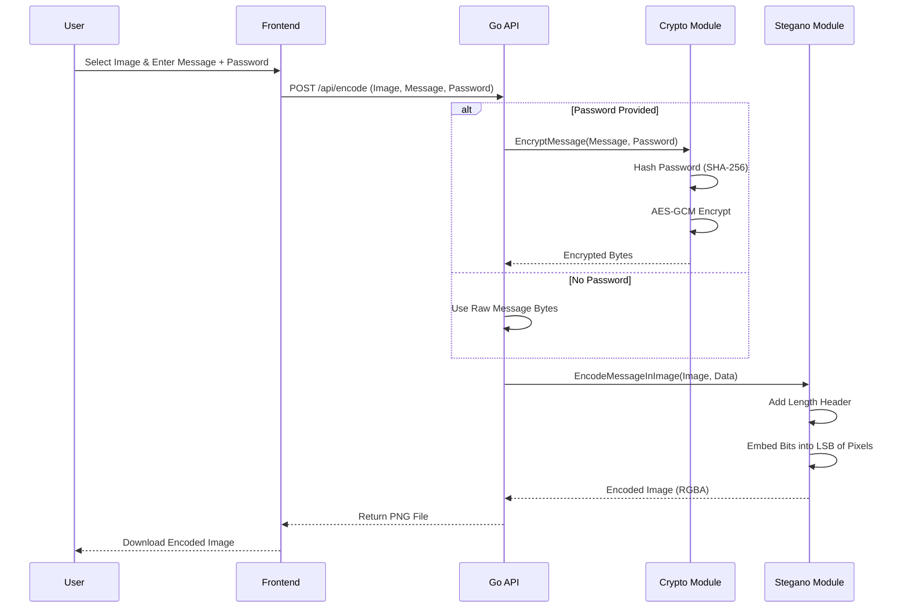
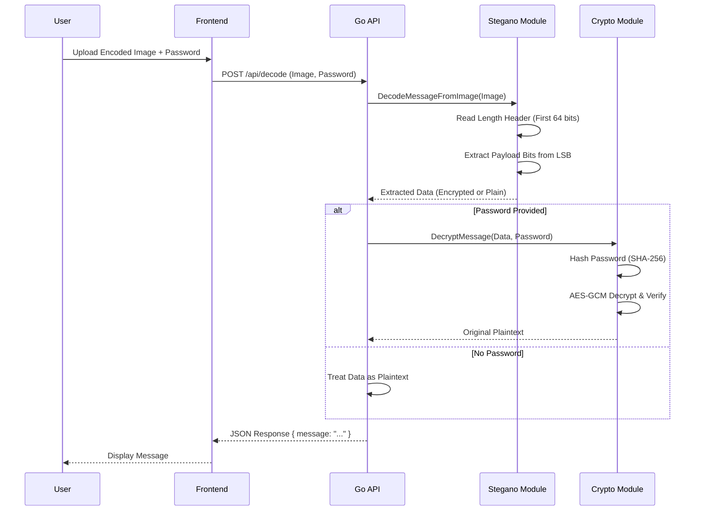

# II. System Design / Architecture

## System Overview
The Steganography Tool follows a classic **Client-Server Architecture**. It is designed to be stateless, ensuring scalability and privacy (no user data is stored on the server).

### High-Level Architecture

```mermaid
graph LR
    User[User] -- Browser --> Frontend[Frontend (HTML/JS)]
    Frontend -- HTTP POST --> Backend[Backend API (Go)]
    Backend -- Process --> Logic[Core Logic (Crypto/Stegano)]
    Logic -- Return --> Backend
    Backend -- Response --> Frontend
```

## Data Flow Diagrams

### 1. Encoding Process (Hiding a Message)

This flow describes how a message travels from the user to the final encoded image.



### 2. Decoding Process (Extracting a Message)

This flow describes how a hidden message is retrieved from an image.



## Component Structure

### Frontend Layer
-   **HTML5/CSS3**: Provides the structure and styling (Dark Mode UI).
-   **JavaScript (Vanilla)**: Handles user interactions, file previews, and asynchronous API calls (`fetch`).

### Backend Layer (Go)
-   **Router (`main.go`)**: Routes HTTP requests to appropriate handlers.
-   **Handlers (`handlers/`)**:
    -   `HandleEncode`: Parses multipart forms, orchestrates encryption and encoding.
    -   `HandleDecode`: Parses multipart forms, orchestrates decoding and decryption.
-   **Utilities (`utils/`)**:
    -   `crypto.go`: Encapsulates AES-256-GCM and SHA-256 logic.
    -   `steganography.go`: Contains the low-level pixel manipulation logic for LSB.

## Security Architecture
1.  **Transport Security**: The application is designed to run behind Nginx with SSL/TLS (HTTPS), ensuring data is encrypted in transit between client and server.
2.  **Data Security**:
    -   **At Rest**: No data is stored on the server. Images are processed in memory and returned immediately.
    -   **In Image**: Data inside the image is encrypted with AES-256 (if password is used), rendering it useless to steganalysis tools that might detect the hidden data but cannot read it.
